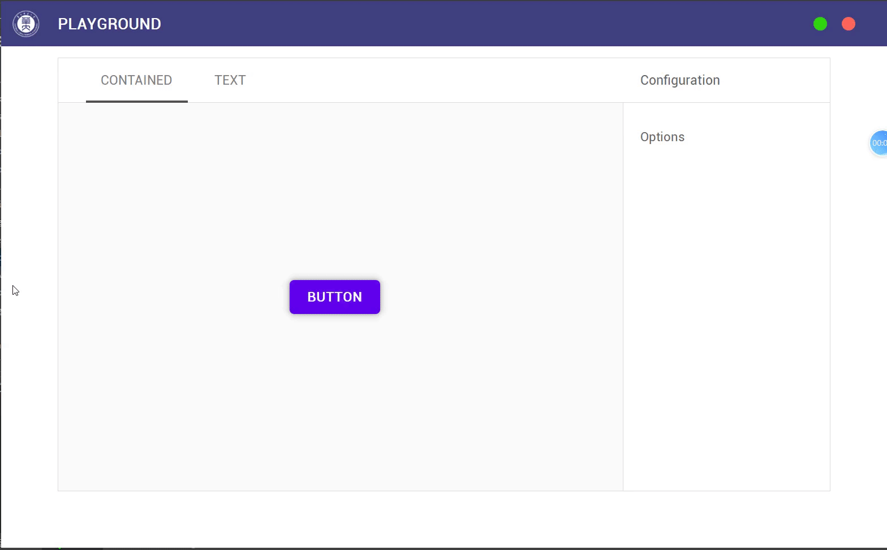

# MeterialQT

A Modern UI design for pyqt5(based on [Meterial Design](https://www.material.io/))

### Quick Look

### Finished
+ Buttons
+ Cards
+ TopBar
+ Navigation drawer

### TODO
+ Floatting PushButton
+ Data tables
+ Dialogs
+ Image list